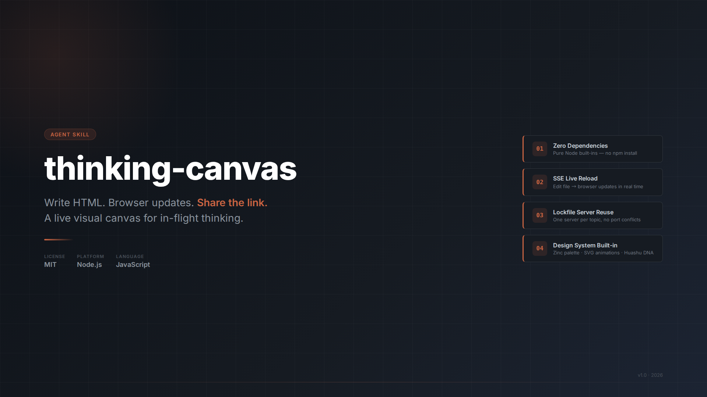
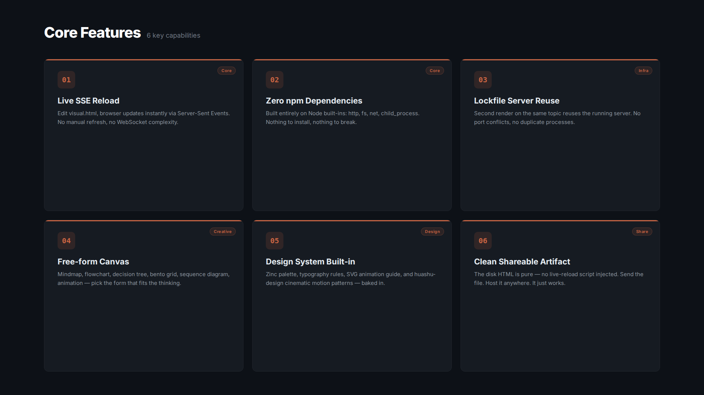
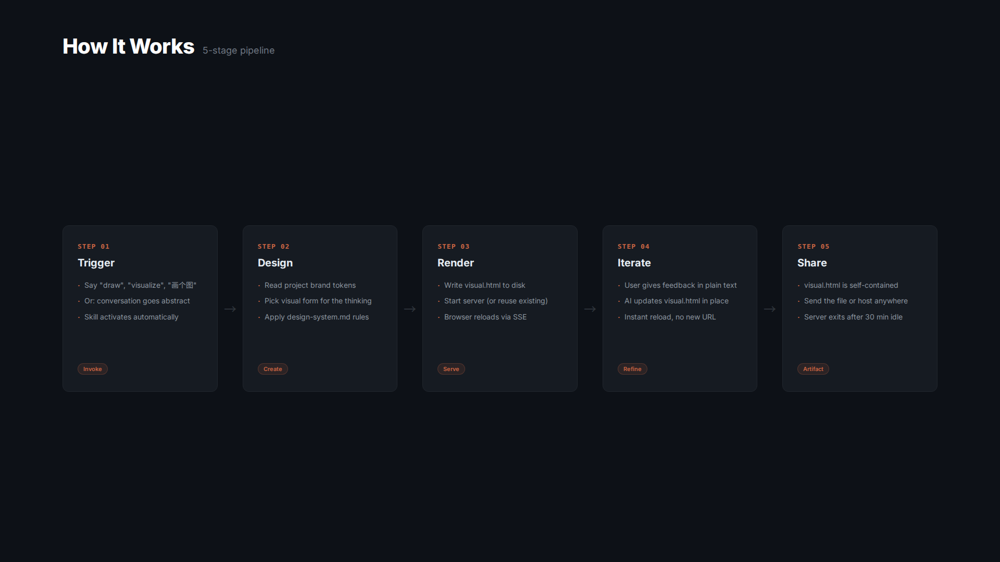

<div align="center">

# thinking-canvas

**Write HTML. Browser updates. Share the link.**



[](./LICENSE)
[](https://nodejs.org)
[](#)
[](#install-as-a-skill)

</div>

---

## What is this

A Copilot CLI / Claude Code skill that turns the AI's in-flight thinking into a live, browser-based HTML/SVG canvas — with instant reload, zero dependencies, and a clean shareable artifact.

When conversation grows abstract ("let's compare these two approaches") or a decision point is reached in brainstorming, the skill writes a visual.html file and starts a local server. The browser reloads live as the AI iterates. No ceremony, no templates — the AI picks the visual form (mindmap, flowchart, bento grid, sequence diagram) that best serves the thinking at that moment.

```
Input:  "visualize the tradeoffs between these three architectures"
Output: http://localhost:52341  →  opens in browser, live-updates as AI refines
```

---

## Core Features



---

## How It Works



---

## Install as a Skill

```bash
npx skills add https://github.com/geekjourneyx/thinking-canvas
```

No `npm install` required. The server (`scripts/canvas.cjs`) uses only Node built-ins.

---

## Quick Start

The skill activates automatically when you say "draw", "visualize", "diagram", "画个图", or similar. You can also invoke it manually:

```bash
node scripts/canvas.cjs render --topic "auth-flow"
# → {"url":"http://localhost:52341","port":52341,"topic_dir":"/your/project/docs/brainstorm/auth-flow"}
```

Open the URL. Edit `docs/brainstorm/auth-flow/visual.html`. Browser reloads live.

**Second render on the same topic reuses the server** — no port conflicts:

```bash
node scripts/canvas.cjs render --topic "auth-flow"
# → reuses existing server, broadcasts reload to open browsers
```

The server exits automatically after 30 minutes idle. No stop command needed.

---

## Design System

Every generated canvas applies `references/design-system.md` — first-principles design DNA covering typography, motion, color, and cinematic animation patterns:

- **Typography:** Satoshi · Cabinet Grotesk · Instrument Serif + Geist pairings. `Inter` banned.
- **Color:** Zinc neutral base · one accent max · `#0D1117` neon-cyber dark banned
- **Motion:** Animate only `transform` + `opacity` · Slow-Fast-Boom-Stop narrative · `linear` easing banned
- **SVG:** Path drawing · SMIL · stagger · morph — full reference in `references/svg-animations.md`
- **AI Tells:** 17 forbidden patterns catalogued and actively avoided

---

## File Structure

| Path | Purpose |
|------|---------|
| `scripts/canvas.cjs` | Single-file CLI server (zero deps) |
| `SKILL.md` | Skill capability spec for AI agents |
| `references/design-system.md` | Design system DNA (typography, color, motion, cinematic patterns) |
| `references/svg-animations.md` | SVG/CSS/SMIL animation technique reference |
| `tests/test-render.sh` | Integration test |
| `assets/` | README infographics |

Canvas output is written to `$(pwd)/docs/brainstorm/<slug>/visual.html` in the active project directory.

---

## License

[MIT](./LICENSE) — free to use, modify, and distribute.

---

## About

| | |
|:---|:---|
| GitHub | [geekjourneyx](https://github.com/geekjourneyx) |
| Repository | [geekjourneyx/thinking-canvas](https://github.com/geekjourneyx/thinking-canvas) |
